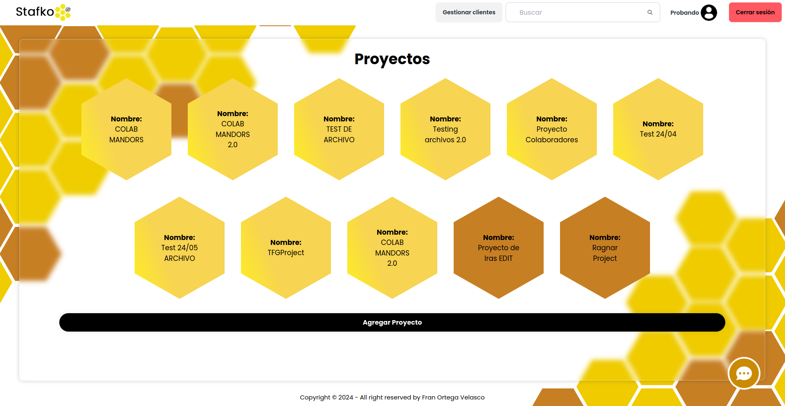

  

<h1 align="center">
React Application Stafko - Beebit
</h1>

# Getting Started with Create React App

This project was bootstrapped with [Create React App](https://github.com/facebook/create-react-app).

## Available Scripts

In the project directory, you can run:

### `npm start`

Runs the app in the development mode.\
Open [http://localhost:3001](http://localhost:3001) to view it in your browser.

The page will reload when you make changes.\
You may also see any lint errors in the console.

### `npm install`

Installs the necessary dependencies to run the application.\

## Screenshots

### Register:

### Login:

### Reset Password:

### Main Page:

### Form Nuevo Proyecto:

### Form Editar Proyecto:

### Detalles del Proyecto:
