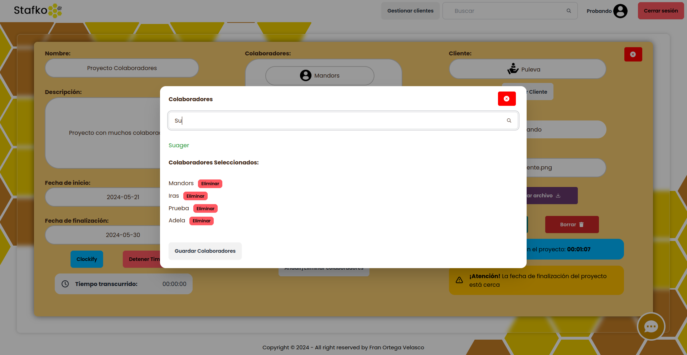
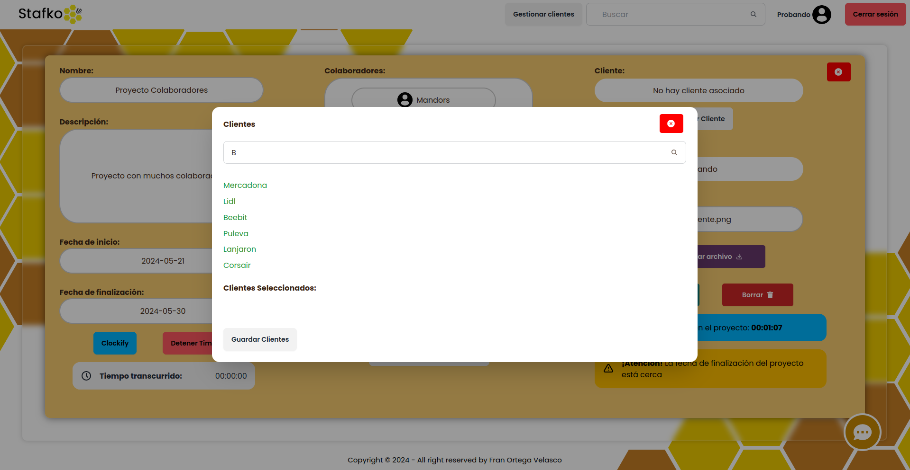

  

<h1 align="center">
React Application Stafko - Beebit | Fran
</h1>

# Empieza con Create React App

Este proyecto fue creado con [Create React App](https://github.com/facebook/create-react-app).

## About

Bienvenido a mi aplicación de gestión de proyectos, creada durante el periodo de prácticas en BeeBit en 2024. Esta aplicación te permite administrar proyectos de manera eficiente, colaborar con tu equipo, y gestionar el tiempo con la integración de Clockify.

Funcionalidades destacadas:

- Registro de usuarios y autenticación segura.
- Subida y gestión de proyectos.
- Integración con la API de Clockify para registrar tiempo.
- Posibilidad de añadir colaboradores y clientes a proyectos.

## Scripts Disponibles

En el directorio del proyecto, Puedes ejecutar:

### `npm start`

Inicia la aplicacion.\
Abre [http://localhost:3001](http://localhost:3001) para visualizarlo en tu navegador.

La página se actualizará automaticamente cuando hagas cambios.\
Es posible que también veas cualquier error de lint en la consola.

### `npm install`

Instala las dependencias necesarias para ejecutar la aplicación.

## Screenshots

### Register:

### Login:

### Reset Password:

### Main Page:

### Form Nuevo Proyecto:

### Form Editar Proyecto:

### Detalles del Proyecto:

### Form Nuevo Cliente:

### Añadir Colaboradores:

### Añadir Clientes:

### Añadir Time Entry en Clockify:
